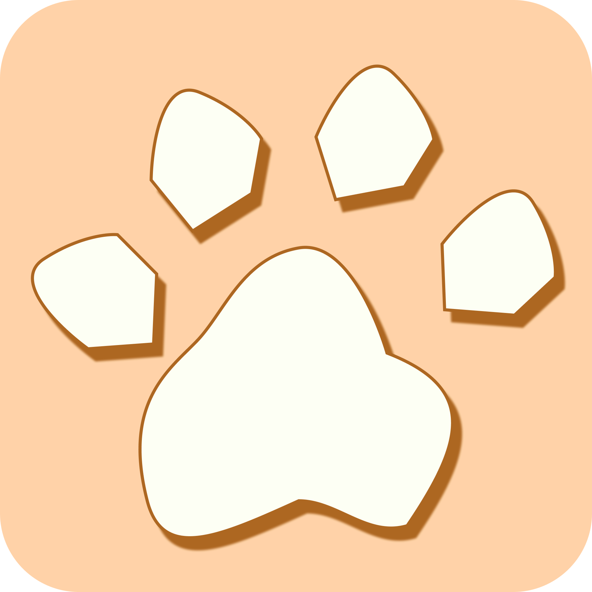

<!-- markdownlint-disable-next-line -->

  

<h1 align="center">Nekotorae</h1>

Nekotorae is a VR experience that gets people to exercise in a chaotic environment filled with interesting cats! The cats will attempt to escape from the room and your only goal is to keep them from leaving. How long can you survive for?

Nekotorae is meant to be deployed on a standalone device to accomodate for the 3m x 3m play area. The omission of joystick movement allows the VR experience to be more beginner friendly

## Background

  

Nekotorae was a project made in roughly the span of a month for the competiton NAPROCK2024 hosted by Procon. 

All 3D models & animations were done by [@Leroy-Hong](https://www.github.com/Leroy-Hong)

90% of the programming was done by [@jer123se12](https://github.com/jer123se12)

## Poster
